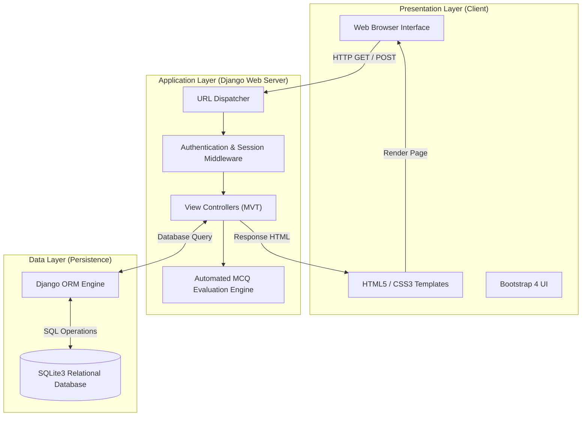
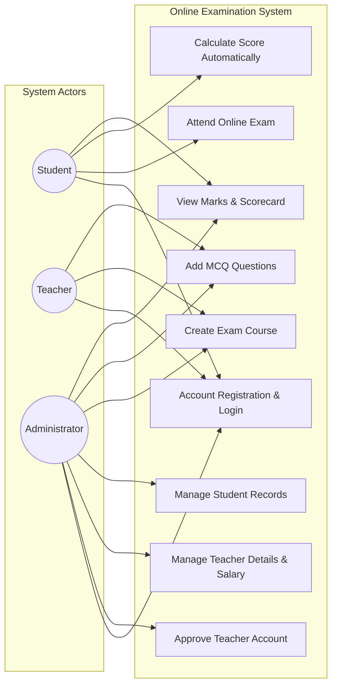
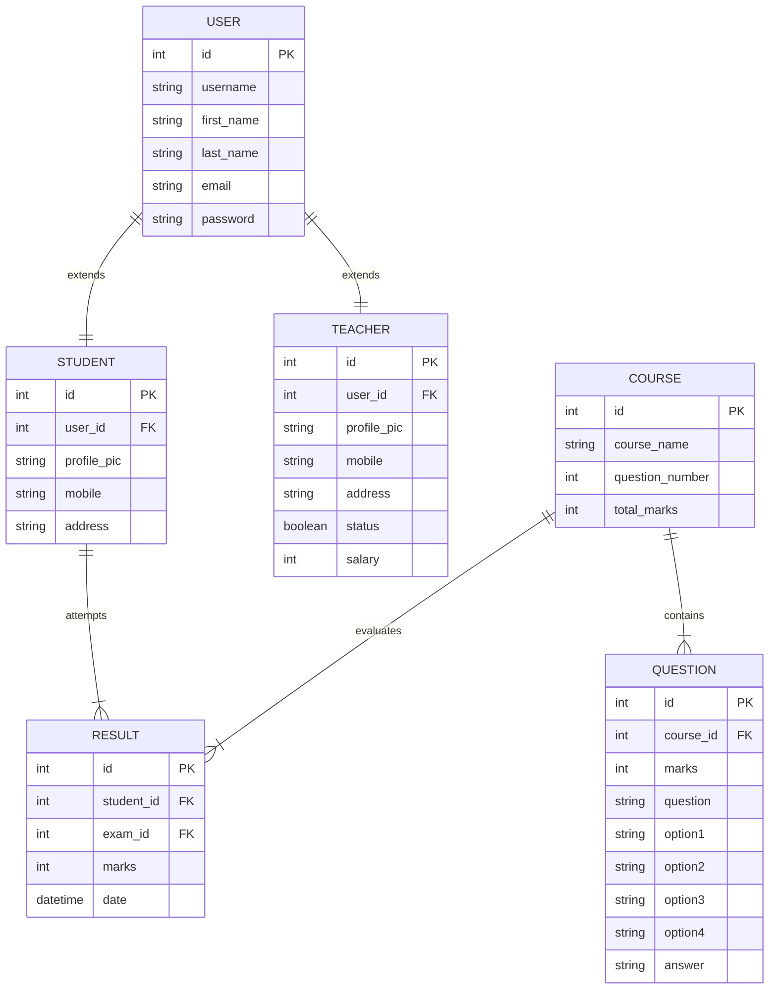

# 🎓 Online Examination System (OES)

<p align="center">
  <a href="https://alijahan.pythonanywhere.com/">
    
  </a>
  <a href="https://www.python.org/">
    
  </a>
  <a href="https://www.djangoproject.com/">
    
  </a>
  <a href="https://www.sqlite.org/">
    
  </a>
  <a href="https://getbootstrap.com/">
    
  </a>
</p>

---

## 📌 Table of Contents
1. [Project Overview](#-project-overview)
2. [Live Application Access](#-live-application-access)
3. [System Analysis & Design (SAD) Diagrams](#-system-analysis--design-sad-diagrams)
   - [1. System Architecture (3-Tier)](#1-system-architecture-3-tier)
   - [2. Use Case Diagram](#2-use-case-diagram)
   - [3. Entity-Relationship Diagram (ERD)](#3-entity-relationship-diagram-erd)
4. [Key Features](#-key-features)
   - [Student Module](#student-module)
   - [Teacher Module](#teacher-module)
   - [Admin Module](#admin-module)
5. [Local Development Setup (VS Code)](#-local-development-setup-vs-code)
6. [Deployment Guide (PythonAnywhere)](#-deployment-guide-pythonanywhere)
7. [Database Structure](#-database-structure)
8. [Author & License](#-author--license)

---

## 📖 Project Overview

The **Online Examination System (OES)** is a web-based portal developed using **Python** and **Django** as a term project for the **System Analysis and Design (SAD)** course at **Daffodil International University**. 

The system digitizes and automates the traditional examination process by offering role-based portals for Students, Teachers, and Administrators. It allows instructors to manage MCQ question banks and enables students to take exams online with automated score calculation.

---

## 🌐 Live Application Access

The project is deployed and live on PythonAnywhere:

- 🌐 **Live Website**: [https://alijahan.pythonanywhere.com/](https://alijahan.pythonanywhere.com/)
- ⚙️ **Hosting**: PythonAnywhere WSGI Server
- 🛡️ **Security**: Django Authentication & CSRF Protection

---

## 📐 System Analysis & Design (SAD) Diagrams

### 1. System Architecture (3-Tier)

The application follows a standard **3-Tier Architecture** implemented through Django's Model-View-Template (MVT) design pattern.



---

### 2. Use Case Diagram

Standard UML Use Case Diagram representing functional interactions between system actors (**Student**, **Teacher**, **Administrator**) and core system boundaries.



---

### 3. Entity-Relationship Diagram (ERD)

The conceptual entity-relationship model defines database entity attributes, primary/foreign keys, and relational cardinalities across the system.



---

## ⚡ Key Features

### Student Module
- **Registration & Authentication**: Students can sign up and log in securely.
- **Course Selection**: Browse available exam courses and view exam guidelines.
- **Online MCQ Examination**: Attend timed multiple-choice question tests online.
- **Instant Result Evaluation**: Automated score calculation upon test submission.
- **Marksheet & History**: Track performance history and marks achieved across different exams.

### Teacher Module
- **Instructor Signup**: Register as a teacher (requires administrative account verification).
- **Course Management**: Add and manage exam subjects along with total question count and marks.
- **Question Bank Curation**: Add MCQs with 4 options and set the correct option key.
- **View Assigned Questions**: Inspect questions linked to created exam modules.

### Admin Module
- **Teacher Account Approval**: Approve or decline newly registered teacher accounts.
- **Salary Management**: Assign and manage salaries for verified teachers.
- **Student & Teacher Audit**: View and manage enrolled student and teacher profiles.
- **Exam & Question Governance**: Add or remove courses, questions, and manage question sets.
- **Institution Marksheets**: Audit student examination performance and overall marksheets.

---

## 💻 Local Development Setup (VS Code)

### Prerequisites
- Python 3.8 or higher installed on your PC.
- Git version control installed.
- VS Code editor.

### Step-by-Step Instructions

1. **Clone the Repository**
   ```bash
   git clone https://github.com/alijahan365/Online-Examination-System.git
   cd Online-Examination-System
   ```

2. **Create & Activate Virtual Environment**
   - **Windows (PowerShell)**:
     ```powershell
     python -m venv venv
     .\venv\Scripts\activate
     ```
   - **macOS / Linux**:
     ```bash
     python3 -m venv venv
     source venv/bin/activate
     ```

3. **Install Dependencies**
   ```bash
   pip install -r requirements.txt
   ```

4. **Run Database Migrations**
   ```bash
   python manage.py makemigrations
   python manage.py migrate
   ```

5. **Create Admin Superuser**
   ```bash
   python manage.py createsuperuser
   ```

6. **Start Local Server**
   ```bash
   python manage.py runserver
   ```
   Navigate to `http://127.0.0.1:8000/` in your browser.

---

## ☁️ Deployment Guide (PythonAnywhere)

The application is deployed on **PythonAnywhere** at `https://alijahan.pythonanywhere.com/`.

1. **Upload Code**: Clone repository into PythonAnywhere Bash console.
2. **Create Virtualenv**: Set up Python virtual environment (`mkvirtualenv --python=/usr/bin/python3.10 oes-env`) and install `requirements.txt`.
3. **Migrate & Collect Static Files**:
   ```bash
   python manage.py migrate
   python manage.py collectstatic --noinput
   ```
4. **WSGI Setup**: Configure WSGI file (`onlinexam/wsgi.py`) pointing to your project directory.
5. **Static Mappings**: Set `/static/` pointing to `/home/alijahan/Online-Examination-System/static/`.
6. **Reload**: Reload the Web app from PythonAnywhere dashboard.

---

## 🗄️ Database Structure

```text
+------------------+          +-------------------+          +------------------+
|     Student      |          |       User        |          |     Teacher      |
+------------------+          +-------------------+          +------------------+
| id               | 1      1 | id                | 1      1 | id               |
| user_id (FK)     |<-------->| username          |<-------->| user_id (FK)     |
| profile_pic      |          | first_name        |          | profile_pic      |
| mobile           |          | email             |          | status           |
| address          |          +-------------------+          | salary           |
+--------+---------+                                         +------------------+
         | 1
         |
         | N
+--------v---------+          +-------------------+          +------------------+
|      Result      |          |      Course       |          |     Question     |
+------------------+          +-------------------+          +------------------+
| id               | N      1 | id                | 1      N | id               |
| student_id (FK)  |<-------->| course_name       |<-------->| course_id (FK)   |
| exam_id (FK)     |          | question_number   |          | question         |
| marks            |          | total_marks       |          | option1..option4 |
| date             |          +-------------------+          | answer           |
+------------------+                                         +------------------+
```

---

## 👨‍💻 Author & License

<p align="center">
  <b>Developed by</b>: Ali Jahan <br>
  <b>Course</b>: System Analysis and Design (SAD) <br>
  <b>University</b>: Daffodil International University <br>
  <b>Live Site</b>: <a href="https://alijahan.pythonanywhere.com/">alijahan.pythonanywhere.com</a>
</p>

---

Copyright © 2026 Ali Jahan. All rights reserved.  
*Developed for academic evaluation at Daffodil International University.*
